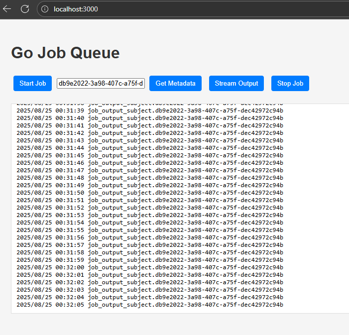

# go-jobqueue
Distributed job queue written in Go using NATS

## Prerequisites
- Run NATS with jetstream
```
docker network create nats
docker run --name nats --network nats --rm -p 4222:4222 -p 8222:8222 nats --http_port 8222 -js  # -js enables jetstream
```
- Create the dummy job binary:
```
cd dummy-job
go build .
```

## Run worker
```bash
go run ./worker
```

## Trigger a job

Each job gets a new Job ID (uuid4)
```bash
curl -X POST http://localhost:3000/v1/job

{
    "id": "db9e2022-3a98-407c-a75f-dec42972c94b",
    "name": "job_output_subject.db9e2022-3a98-407c-a75f-dec42972c94b"
}
```

## Get metadata about the job
```
curl -X GET http://localhost:3000/v1/job/<job-id> && echo
{
    "id": "<job-id>",
    "name": "job_output_subject.<job-id>"
}
```

## Stream job output
This can be done via a websocket client. The easiest way is to:
- open up the browser
- point it towards localhost:3000
- enter the job ID



Note: Each new websocket client will read the job output from the very beginning.


## Running in production
### Prerequisites
- Docker and docker compose
- NATS
- Make (optional, for using the Makefile)


### 1. Build and Start Services

```bash
# Build all images and start services
make build
make up

# Or use docker-compose directly
docker-compose build
docker-compose up -d
```

### 2. Access the Application

- **Main Application**: http://localhost
- **Traefik Dashboard**: http://localhost:8080 (disabled by default)
- **NATS Monitoring**: http://localhost:8222

### 3. Test the Application

```bash
# Create a job
curl -X POST http://localhost/v1/job

# Check service status
make status
```

## Design

The Docker setup includes:

- **Go Application Instances**: Horizontally scalable workers
- **NATS Server**: Message broker with JetStream enabled
- **Traefik**: Load balancer and reverse proxy
- **Docker Network**: Isolated network for all services

## Service Configuration

### Go Application Instances

Each instance:
- Runs on internal port 3000
- Connects to NATS via Docker service discovery
- Can be scaled independently
- Serves both API and UI

### NATS Configuration

- **Port**: 4222 (client), 8222 (monitoring, disabled in production)
- **JetStream**: Enabled for persistent streams
- **Network**: Isolated within Docker network

### Traefik Configuration

- **HTTP Port**: 80
- **HTTPS Port**: 443
- **Dashboard**: 8080 (Disabled in production)
- **Auto-discovery**: Automatically detects services via Docker labels

## Scaling

### Scale Application Instances

```bash
# Scale to 5 instances
make scale N=5

# Or use docker-compose directly
docker-compose up -d --scale app=5
```

### Update Services

```bash
# Rebuild and restart
make build
make up
```

## Environment Variables

### NATS_URL

- **Default**: `nats://nats:4222` (Docker service name)
- **Override**: Set to external NATS server if needed
- **Format**: `nats://hostname:port`

## Troubleshooting

### Check Service Status

```bash
make status
docker-compose ps
```

### View Logs

```bash
# All services
make logs

# Specific service
docker-compose logs -f app-1
```

### Clean Up

```bash
# Stop and remove everything
make clean

# Or step by step
make down
docker system prune -f
```

## TODO
- filter job output stream by job ID
- keep a limit on number of messages in NATS stream
- allow multiple job types (today we only trigger the dummy job)
